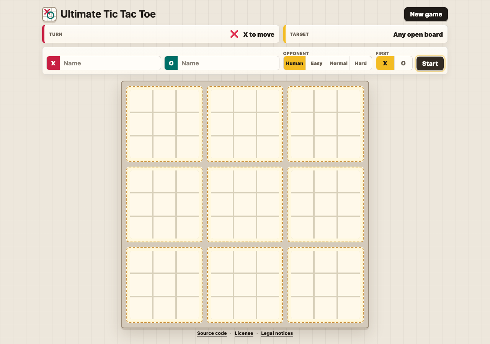
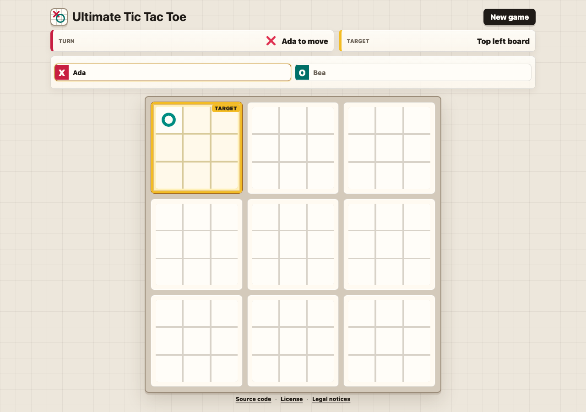

# Ultimate Tic Tac Toe

[](https://github.com/carjorvaz/cl-ultimate-tic-tac-toe/actions/workflows/ci.yml)

Server-rendered Ultimate Tic Tac Toe in Common Lisp, using Clack, Lack,
Ningle, Spinneret, a Woo backend by default, a Hunchentoot fallback, and
vendored HTMX for small partial updates.

It supports local two-player games and optional Easy, Normal, or Hard
deterministic computer opponents for O.

Play the deployed app at <https://ultimate-tic-tac-toe.carjorvaz.com/>.

## Screenshots





## Run

```sh
direnv allow
sbcl --script scripts/run.lisp
```

or without enabling direnv:

```sh
nix develop -c sbcl --script scripts/run.lisp
```

The app listens on `http://127.0.0.1:4242/` by default. Set `PORT` to change
the port, set `SERVER=hunchentoot` to use the fallback backend, and set
`SOURCE_CODE_URL` to change the footer source link for deployed forks.
Readiness and version endpoints are available at `/health` and `/version`.

## Test

```sh
direnv exec . sbcl --script scripts/test.lisp
```

Run the browser smoke check for responsive layout, HTMX behavior, computer
opponent play, accessibility structure, browser accessibility-tree coverage,
color contrast, backend health probes, and desktop screenshot regression with:

```sh
direnv exec . node scripts/browser-smoke.mjs
```

or through the flake app:

```sh
nix run .#browser-smoke
```

Refresh the README screenshot baselines from the smoke flow with:

```sh
UPDATE_SCREENSHOTS=1 direnv exec . node scripts/browser-smoke.mjs
```

Regenerate CSS after editing `assets/style.lass` with:

```sh
direnv exec . sbcl --script scripts/build-assets.lisp
```

Verify generated assets are current with:

```sh
direnv exec . sbcl --script scripts/validate-assets.lisp
```

Run the deterministic repository checks used by CI with:

```sh
nix flake check
```

## Repository Knowledge

`AGENTS.md` is the short agent map. Durable project knowledge lives under
`docs/`, including architecture, product behavior, reliability, quality, and
execution-plan guidance.

Validate source boundaries and dependency declarations with:

```sh
direnv exec . sbcl --script scripts/validate-architecture.lisp
```

Validate generated assets with:

```sh
direnv exec . sbcl --script scripts/validate-assets.lisp
```

Validate the repository harness with:

```sh
direnv exec . sbcl --script scripts/validate-docs.lisp
```

## Notes

The Common Lisp project layout and library usage were checked against the
local corpus available at `ssh root@pius:/persist/lisp-corpus`.

Coalton is used for a small typed rules slice in `src/rules.lisp`: local-board
outcomes, global outcomes, and winning-line indexes. The mutable game state,
Lack session handling, Spinneret rendering, and request handling stay in
idiomatic Common Lisp.

HTMX is served from `static/htmx.min.js` so normal local and deployed runs do
not depend on a CDN.

CSS is authored as LASS in `assets/style.lass` and compiled to
`static/style.css`. The web layer serves the generated CSS as a static asset;
it does not generate styles during requests.

## Codex Disclosure

This project was developed with assistance from OpenAI Codex. The maintainer
reviewed and accepted the generated changes, and the project is published under
the license below.

## License

AGPL-3.0-or-later. See `LICENSE`.
